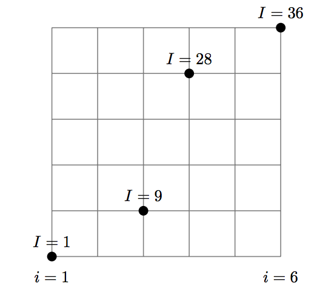

# Crank-Nicholson for Quantum Dynamics

Code by Ruben Biesheuvel and Alexander Harms

This code uses a Crank-Nicholson method to evaluate the time evaluation of a wave function governed by the Schrödinger equation.

```python
>>> import numpy as np
>>> import matplotlib.pyplot as plt
>>> import scipy.sparse as sp
>>> from math import pi
>>> import math
>>> import scipy.sparse.linalg as linalg
>>> from sympy.functions.special.delta_functions import Heaviside
>>> from mpl_toolkits.mplot3d import Axes3D
>>> from matplotlib import animation
>>> import matplotlib.cm as cm
>>> from IPython.display import Image
```

# Crank-Nicholson for one dimensional square well

A stationary Gaussian wave packet is initialized in an "infinite" potential well. The time evolution of the wave equation is calculated through the Schrödinger equation. This is approximated using the Crank-Nicholson method. In this problem Dirichlet boundary conditions are used; on both ends of the domain the wave equation is put to zero. The equation that is solved with the Crank-Nicholson method is the following

$$ i \hbar \frac{\psi(t+h) - \psi(t)}{h} = \frac{ \hat{H} \psi(t) + \hat{H} \psi(t+h)}{2}$$,

where h is the size of the time step, and where $\hat{H}$ is defined as

$$ \hat{H} = \frac{\hat{p}^2}{2m} + \hat{V}$$.

The momentum operator can be discretized in a grid with Dirichlet boundary conditions, and with equal spacing $a$, the matrix of the Hamiltonian is:

$$ \hat{H} = \begin{bmatrix}
1/a^2 + V_0 & -1/2a^2 & 0 & \ldots  & \ldots &  0 \\
-1/2a^2 & 1/a^2 + V_1 & -1/2a^2 & 0 & \ldots & 0  \\
0 & \ddots & \ddots & \ddots & \ldots & 0 \\
0 & \ldots &  0 & -1/2a^2  & 1/a^2 + V_{n-1} & -1/2a^2 & \\
0 & 0 & \ldots & 0 & -1/2a^2&  1/a^2 + V_n \\
\end{bmatrix}
$$,

where $V_i$ is the potential at point $i$.

The system that is being solved is then expressed as

$$ \left( \frac{i \hbar}{h} - \frac{\hat{H}}{2}\right) \psi(t + h) = \left( \frac{i \hbar}{h} + \frac{\hat{H}}{2} \right) \psi(t)$$,

where $\psi(t+h)$ is the desired quantity, and the rest is known. This expression can be simplified to a linear equation as $A \mathbf{x} = \mathbf{b}$, where $A = \left( \frac{i \hbar}{h} - \frac{\hat{H}}{2}\right) $, $\mathbf{x}$ the desired quantity $\psi(t+h)$ and $\mathbf{b} = \left( \frac{i \hbar}{h} + \frac{\hat{H}}{2}\right) \psi(t)$.

Because the coefficient matrix $A$ has an imaginary diagonal, this is not a Hermitian matrix. An algorithm designed for solving such a system can used, two of which are the Bi-Conjugate Gradient Stabalized (BiCGStab) algorithm and the Complex Orthogonal Conjugate Gradient (COCG) algorithm.

In this code, the BiCGStab algorithm has been implemented due to it being readily available in the SciPy package.

```python
>>> # Set parameters
... h = 1e-5 #timestep size
>>> xmin = 0
>>> xmax = 1
>>> nodes = 2**8
...
>>> a = 1 / (nodes-1) #space between nodes
>>> x = np.linspace(xmin, xmax, nodes)
>>> timesteps = 1000
...
>>> #initial wave function
... psi = np.zeros(shape = (nodes, timesteps+1), dtype= np.cfloat)
>>> width = 0.01
>>> p0 = 0 #standing still
>>> E0 = p0**2 / 2
>>> psi[:, 0] = np.exp(-((x-0.45)**2 / (2*width**2)))*np.exp(1j*x*p0)
>>> psi[:, 0] = psi[:, 0] / np.linalg.norm(psi[:, 0])
...
>>> #Make square well
... V0 = 200000
>>> V = np.zeros(nodes)
>>> for xx in range(nodes):
...     V[xx] =  -V0 * (Heaviside(0.35/a - xx) - Heaviside(0.55/a - xx))
...
>>> #Make left hand side matrix
... A = sp.diags([1 / (4*a**2), 1j/h - 1/(2*a**2), 1 / (4*a**2)],[-1, 0 ,1],shape=(nodes, nodes)).tolil()
>>> A -= 0.5 * sp.diags(V, 0)
>>> A[0, -1] = 1 / (4*a**2)
>>> A[-1, 0] = 1 / (4*a**2)
>>> A = A.tocsc()
>>> Ainv = linalg.inv(A)
>>> Ainv = Ainv.todense()
...
>>> #Make right hand side vector
... B = sp.diags([-1 / (4*a**2), 1j/h + 1/(2*a**2), -1 / (4*a**2)],[-1, 0, 1],shape=(nodes, nodes)).tolil()
>>> B += 0.5*sp.diags(V, 0)
>>> B[0, -1] = -1 / (4*a**2)
>>> B[-1, 0] = -1 / (4*a**2)
>>> B = B.todense()
...
>>> C = np.dot(Ainv,B)
...
>>> for t in range(timesteps):
...     psi[:, t+1] = np.dot(C, psi[:, t])
...     psi[:, t+1] = psi[:, t+1] / np.linalg.norm(psi[:, t+1])
```

```python
>>> # Plot the wave function at a (certain range of) timestep(s)
... plt.plot(np.absolute(psi[:, 0:500:100]))
>>> plt.plot(V / abs(V0)) #plot normalized potential well
>>> plt.xlim(xmin=0, xmax =2**8)
```

```python
>>> fig = plt.figure()
>>> ax = plt.axes(xlim=(0, 1), ylim=(0, 1))
>>> line, = ax.plot([], [], lw=2)
>>> V_x, = ax.plot([],[], lw=2)
...
...
>>> # initialization function: plot the background of each frame
... def init():
...     line.set_data([], [])
...     V_x.set_data([], [])
...
...     return line, V_x,
...
...
>>> # animation function: this will be called upon every frame with index i.
... def animate(i):
...     y = np.absolute(psi[:, i])
...     line.set_data(x, y)
...     V_x.set_data(x, V)
...
...     return line, V_x,
...
>>> # call the animator.  blit=True means only re-draw the parts that have changed.
... animsqwell = animation.FuncAnimation(fig, animate, init_func=init,
...            frames=timesteps, interval=20, blit=True, repeat=False)
...
...
>>> plt.show()
```

```python
>>> # Save the animation to disk
... Writer = animation.writers['ffmpeg']
>>> writer = Writer(fps=25, metadata=dict(artist='Me'), bitrate=1800)
>>> animsqwell.save('1DSquarewell.mp4', writer=writer)
```

# Crank Nicholson for tunneling

```python
>>> #Set up parameters
... h = 1e-5
>>> nodes = 2000
>>> xmin = 0
>>> xmax = 1
>>> a = 1 / (nodes-1)
>>> x = np.linspace(xmin, xmax, nodes)
>>> timesteps = 1000
...
>>> #Set up wave funciton
... psi = np.zeros(shape = (nodes, timesteps+1), dtype= np.cfloat)
>>> width = 0.01
>>> p0 = 30
>>> psi[:, 0] = np.exp(-((x - 0.52)**2 / (2*width**2))) * np.exp(1j*x*p0)
>>> psi[:, 0] = psi[:, 0] / np.linalg.norm(psi[:, 0])
...
>>> #Set up potential wall with height E0/0.6
... E0 = p0**2 / 2
>>> V0 = E0 / 0.6
>>> V = np.zeros(nodes)
>>> for xx in range(nodes):
...     V[xx] =  -V0 * (Heaviside(0.55/a - xx) - Heaviside(0.55/a + 1/(a*np.sqrt(V0)) - xx))
...
>>> #Create left hand side matrix
... A = sp.diags([1 / (4*a**2), 1j/h- 1/(2*a**2), 1 / (4*a**2)],[-1, 0 ,1],shape=(nodes, nodes)).tolil()
>>> A -= 0.5 * sp.diags(V, 0)
>>> A[0, -1] = 1 / (4*a**2)
>>> A[-1, 0] = 1 / (4*a**2)
>>> A = A.tocsc()
>>> Ainv = linalg.inv(A)
>>> Ainv = Ainv.todense()
...
>>> #Create right hand side matrix
... B = sp.diags([-1 / (4*a**2), 1j/h + 1/(2*a**2), -1 / (4*a**2)],[-1, 0, 1], shape = (nodes, nodes)).tolil()
>>> B += 0.5 * sp.diags(V, 0)
>>> B[0, -1] = -1 / (4*a**2)
>>> B[-1, 0] = -1 / (4*a**2)
>>> B = B.todense()
...
>>> C = np.dot(Ainv,B)
...
>>> for t in range(timesteps):
...     psi[:, t+1] = np.dot(C, psi[:, t])
...     psi[:, t+1] = psi[:, t+1] / np.linalg.norm(psi[:, t+1])
```

```python
>>> # Plot the wave function at a (certain range of) timestep(s)
... plt.plot(np.absolute(psi[:, 0:100:50]))
>>> plt.plot(V / abs(V0))
>>> plt.xlim(xmin=900, xmax=1250)
```

```python
>>> fig = plt.figure()
>>> ax = plt.axes(xlim=(0, 1), ylim=(0, 1))
>>> print(abs(V0))
>>> line, = ax.plot([], [], lw=2)
>>> V_x, = ax.plot([],[], lw=2)
...
>>> # initialization function: plot the background of each frame
... def init():
...     line.set_data([], [])
...     V_x.set_data([], [])
...
...     return line, V_x,
...
...
>>> # animation function: this will be called upon every frame with index i.
... def animate(i):
...     y = np.absolute(psi[:,i])
...     line.set_data(x, y)
...     V_x.set_data(x, V)
...     return line, V_x,
...
>>> # call the animator.  blit=True means only re-draw the parts that have changed.
... animtunnel = animation.FuncAnimation(fig, animate, init_func=init,
...            frames=timesteps, interval=20, blit=True, repeat=False)
...
>>> plt.show()
```

```python
>>> # Set up formatting for the movie files
... Writer = animation.writers['ffmpeg']
>>> writer = Writer(fps=25, metadata=dict(artist='Me'), bitrate=1800)
>>> animtunnel.save('1DTunneling.mp4', writer=writer)
```

# Crank-Nicholson in two dimensions

The 2D method of Crank-Nicholson makes use of a lexicographic ordering of nodes (image taken from [1]),
.

This results in the solution vector $u \in \mathbb{R}^{nodes^2}$ and the Coefficient matrix $A \in \mathbb{R}^{(nodes^2)~ \times~ (nodes^2)}$.

For this two dimensional problem, the boundary conditions are taken to be Dirichlet boundary conditions, with the forcing term equal to 0 for simplicity. If this is done, the coefficient matrix can be expressed as [1]:

$$\hat{H}_{2D} = \hat{H}_{1D} \otimes \mathbb{1} + \mathbb{1} \otimes \hat{H}_{1D}$$,

where $H_{1D}$ is the Hamiltonian matrix for the 1D case without the potential, and $\mathbb{1}$ is the identity matrix with the same size as $H_{1D}$. The potential is removed due to the fact that it is a 2D potential that can not be expressed in a 1D case. The potential diagonal is added after the 2D kinetic energy matrix is generated.

The system that is being solved can therefore be expressed as

$$ \left( \frac{i \hbar}{h} - \frac{\hat{H}_{2D}}{2} - \frac{\hat{V}}{2} \right) \psi(t + h) = \left( \frac{i \hbar}{h} + \frac{\hat{H}_{2D}}{2} + \frac{\hat{V}}{2} \right) \psi(t)$$,

where $\psi(t+h)$ is the desired quantity, and the rest is known. This expression can be simplified to a linear equation as $A \mathbf{x} = \mathbf{b}$, where $A = \left( \frac{i \hbar}{h} - \frac{\hat{H}_{2D}}{2} - \frac{\hat{V}}{2} \right) $, $\mathbf{x}$ the desired quantity $\psi(t+h)$ and $\mathbf{b} = \left( \frac{i \hbar}{h} + \frac{\hat{H}_{2D}}{2} + \frac{\hat{V}}{2} \right) \psi(t)$.

This system is again solved with a BiCGStab algorithm.

$\large \bf{References}$

[1] C. Vuik and D.J.P. Lahaye. $\textit{Lecture notes in Scientific Computing}$. Sept. 2015.

```python
>>> #Set up parameters
... h = 1e-5
>>> nodes = 2**8
>>> xmin = 0
>>> xmax = 1
>>> a = 1 / (nodes-1)
>>> x = np.linspace(xmin, xmax, nodes)
>>> timesteps = 1000
>>> wall = int(2*nodes / 3)
>>> middle = int(nodes / 2)
...
>>> #Make initial wave function using x-lexicographic ordering of gridpoints
... psi = np.zeros(shape = (len(x), ), dtype= np.cfloat)
>>> width = 0.05
>>> p0 = 500
>>> E0 = p0**2 / 2
>>> wave_position = np.arange(0, wall*a - 3*width, 3*width)
>>> for i in range(len(wave_position)):
...     psi += np.exp(-((x-wave_position[i])**2 / (2*width**2))) * np.exp(1j*x*p0)
...
>>> psi = psi / np.linalg.norm(psi)
>>> psi2 = np.tile(psi, (nodes, 1)) #Make a 2d vector by stacking Gaussians
>>> psi2_plot = np.zeros((nodes, nodes, timesteps+1), dtype= np.cfloat)
>>> psi2_plot[:, :, 0] = psi2
>>> psi2 = psi2.reshape(-1) #Make into 1d vector
...
>>> #Make potential barrier
... V = np.zeros((nodes, nodes))
>>> V0 = 1e6
>>> aa = 5
>>> bb = 10
>>> for xx in range(nodes):
...     V[xx,wall] = V0 * (math.ceil((Heaviside(xx) - Heaviside(xx - (middle - bb - 0.5*aa))) + (Heaviside(xx - (middle - 0.5*aa)) \
...                       - Heaviside(xx - (middle + 0.5*aa))) + Heaviside(xx - (middle + 0.5*aa + bb))))
...
>>> #Make left hand side vector by expanding the 1D case (using dirichlet boundary conditions at 0)
... A1D = sp.diags([1 / (4*a**2), 1j/h - 1/(2*a**2), 1 / (4*a**2)], [-1, 0 ,1], shape = (nodes, nodes))
>>> I = sp.identity(nodes)
>>> A2D = sp.kron(A1D, I) + sp.kron(I, A1D)
>>> A2D -= 0.5 * sp.diags(V.reshape(-1), 0)
...
>>> #Make right hand side vector in the same way
... B1D = sp.diags([-1 / (4*a**2), 1j/h + 1/(2*a**2), -1 / (4*a**2)],[-1, 0, 1], shape = (nodes, nodes))
>>> B2D = sp.kron(B1D, I) + sp.kron(I, B1D)
>>> B2D += 0.5 * sp.diags(V.reshape(-1), 0)
...
>>> #Using a bicgstab algorithm, solve A*psi(n+1) = B*psi(n) for psi(n+1)
...
... psi2_old = psi2
>>> psi2_new = psi2
>>> xx = range(nodes)
...
>>> for t in range(timesteps):
...     b = B2D.dot(psi2_old)
...     psi2_new = linalg.bicgstab(A2D, b)[0]
...     psi2_new = psi2_new / np.linalg.norm(psi2_new)
...     psi2_old = psi2_new
...     psi2_plot[:, :, t+1] = psi2_new.reshape(nodes, -1) #reshape for plotting
```

```python
>>> xx = range(nodes)
>>> hf = plt.figure()
>>> V_plot = V[:, wall]
>>> X_wall = [wall for i in range(nodes)]
>>> Y_wall = range(nodes)
>>> X, Y = np.meshgrid(xx, xx)
>>> #plt.contourf(X[:,wall:], Y[:,wall:], np.absolute(psi2_plot[:,wall:]))
... fig = plt.figure()
>>> ax = fig.add_subplot(111)
>>> ax.contourf(X[:, :], Y[:, :], np.absolute(psi2_plot[:, :]))
>>> plt.show()
```

```python
>>> fig, ax = plt.subplots()
...
>>> xx = range(nodes)
>>> X,Y = np.meshgrid(xx, xx)
>>> Z = np.zeros(X.shape)
...
...
>>> def init():
...     cont = ax.contourf(X, Y, Z, cmap = cm.bone)
...     V_x = ax.contour(xx, xx, V)
...     cbar = plt.colorbar(cont )
...     return cont, V_x,
...
...
>>> def animate(t):
...     xx = range(nodes)
...     X, Y = np.meshgrid(xx, xx )
...     Z = np.absolute(psi2_plot[:, :, t+1])
...     cont = ax.contourf(X, Y, Z, cmap = cm.bone)
...     V_x = ax.contour(xx, xx, V)
...     return cont, V_x
...
...
>>> anim2D = animation.FuncAnimation(fig, animate, frames = timesteps, interval = 1, repeat = False,  init_func = init,)
>>> plt.show()
```

```python
>>> # Save the animation to disk
... Writer = animation.writers['ffmpeg']
>>> writer = Writer(fps=25, metadata=dict(artist='Me'), bitrate=1800)
>>> anim2D.save('2DDoubleslit.mp4', writer=writer)
```

# Crank-Nicholson 2D Square well

```python
>>> #Set up parameters
... h = 1e-5
>>> nodes = 2**7
>>> xmin = 0
>>> xmax = 1
>>> a = 1 / (nodes-1)
>>> x = np.linspace(xmin, xmax, nodes)
>>> middle = int(nodes / 2)
>>> timesteps = 5000
...
>>> #Make initial wave function using x-lexicographic ordering of gridpoints
... psi_sq = np.zeros(shape = (nodes, nodes), dtype= np.cfloat)
>>> width = 50
>>> for xx in range(nodes):
...     for yy in range(nodes):
...         psi_sq[xx, yy] = np.exp(-(((xx-middle)**2 + (yy-middle)**2) / (2*width**2)))
...
>>> psi_sq = psi_sq / np.linalg.norm(psi_sq)
>>> psi_sq_plot = np.zeros((nodes, nodes, timesteps+1), dtype= np.cfloat)
>>> psi_sq_plot[:, :, 0] = psi_sq
>>> psi_sq = psi_sq.reshape(-1) #Make into 1d vector
...
>>> #Make Potential barrier
... V_sq = np.ones((nodes, nodes))
>>> V0 = 1e7
>>> aa = 2**7-2
>>> bb = 2**7-2
...
>>> V_sq[middle - 0.5*aa:middle + 0.5*aa, middle - 0.5*bb:middle + 0.5*bb] = 0
>>> V_sq = V0 * V_sq
...
...
>>> #Make left hand side vector by expanding the 1D case (using dirichlet boundary conditions at 0)
... A1D = sp.diags([1 / (4*a**2), 1j/h - 1 / (2*a**2), 1 / (4*a**2)], [-1, 0 ,1], shape = (nodes, nodes))
>>> I = sp.identity(nodes)
>>> A2D = sp.kron(A1D, I) + sp.kron(I, A1D)
>>> A2D -= 0.5 * sp.diags(V_sq.reshape(-1), 0)
...
>>> #Make right hand side vector in the same way
... B1D = sp.diags([-1 / (4*a**2), 1j/h + 1 / (2*a**2), -1 / (4*a**2)],[-1, 0, 1], shape = (nodes, nodes))
>>> B2D = sp.kron(B1D, I) + sp.kron(I, B1D)
>>> B2D += 0.5 * sp.diags(V_sq.reshape(-1), 0)
...
>>> #Using a bicgstab algorithm, solve A*psi(n+1) = B*psi(n) for psi(n+1)
...
... psi_sq_old = psi_sq
>>> psi_sq_new = psi_sq
>>> for t in range(timesteps):
...     b = B2D.dot(psi_sq_old)
...     psi_sq_new = linalg.bicgstab(A2D, b)[0]
...     psi_sq_new = psi_sq_new / np.linalg.norm(psi_sq_new)
...     psi_sq_old = psi_sq_new
...     psi_sq_plot[:, :, t+1] = psi_sq_new.reshape(nodes, -1) #reshape for plotting
```

```python
>>> xx = range(nodes)
>>> hf = plt.figure()
>>> X, Y = np.meshgrid(xx, xx)
>>> plt.contourf(X[0, :], Y[:, 0], np.absolute(psi_sq_plot[:, :, 0]))
>>> plt.show()
```

```python
>>> fig, ax = plt.subplots()
...
>>> xx= range(nodes)
>>> X,Y = np.meshgrid(xx, xx)
>>> Z = np.zeros(X.shape)
...
...
>>> def init():
...     cont = ax.contourf(X, Y, Z ,cmap = cm.bone)
...     V_sq_x = ax.contour(xx, xx, V_sq)
...     cbar = plt.colorbar( cont )
...     return cont, V_sq_x,
...
...
>>> def animate(t):
...     xx = range(nodes)
...     X, Y = np.meshgrid(xx, xx )
...     Z = np.absolute(psi_sq_plot[:, :, t+1])
...     cont = ax.contourf(X, Y, Z, cmap = cm.bone)
...     V_sq_x = ax.contour(xx, xx, V_sq)
...     return cont, V_sq_x,
...
...
>>> #anim = animation.FuncAnimation(fig, animate, frames=200, init_func=init)
... anim2Dsq = animation.FuncAnimation(fig, animate, frames = timesteps, interval = 1, repeat = False, init_func = init,)
>>> plt.show()
```

```python
>>> # Set up formatting for the movie files
... Writer = animation.writers['ffmpeg']
>>> writer = Writer(fps=25, metadata=dict(artist='Me'), bitrate=1800)
>>> anim2Dsq.save('2DSquareWell.mp4', writer=writer)
```

# Calculation of the transmission coefficient

```python
>>> #Set up parameters
... h = 1e-5
>>> nodes = 5000
>>> xmin = 0
>>> xmax = 10
>>> a = 1 / (nodes - 1)
>>> x = np.linspace(xmin, xmax, nodes)
>>> timesteps = 1000
...
>>> #Set up wave funciton
... psi = np.zeros(shape = (nodes, timesteps+1), dtype= np.cfloat)
>>> width = 0.01
>>> p0 = 300
>>> psi[:, 0] = np.exp(-((x - 4.5)**2 / (2*width**2))) * np.exp(1j*x*p0)
>>> psi[:, 0] = psi[:, 0] / np.linalg.norm(psi[:, 0])
...
>>> #Set up potential wall with height E0/0.6
... E0 = p0**2 / 2
>>> param = 0.5
>>> V0 = E0 / param
>>> V = np.zeros(nodes)
>>> for xx in range(nodes):
...     V[xx] =  - V0 * (Heaviside(0.5/a - xx) - Heaviside(0.5/a + 7/np.sqrt(2*V0)) - xx))
...
>>> #Create left hand side matrix
... A = sp.diags([1 / (4*a**2), 1j/h- 1/(2*a**2), 1 / (4*a**2)],[-1, 0 ,1],shape=(nodes, nodes)).tolil()
>>> A -= 0.5 * sp.diags(V, 0)
>>> A = A.tocsc()
>>> Ainv = linalg.inv(A)
>>> Ainv = Ainv.todense()
...
>>> #Create right hand side matrix
... B = sp.diags([-1 / (4*a**2), 1j/h + 1/(2*a**2), -1 / (4*a**2)],[-1, 0, 1], shape = (nodes, nodes)).tolil()
>>> B += 0.5 * sp.diags(V, 0)
>>> B = B.todense()
...
>>> C = np.dot(Ainv,B)
...
>>> for t in range(timesteps):
...     psi[:, t+1] = np.dot(C, psi[:, t])
...     psi[:, t+1] = psi[:, t+1] / np.linalg.norm(psi[:, t+1])
```

```python
>>> fig = plt.figure()
>>> ax = plt.axes(xlim=(0, 10), ylim=(0, 1))
>>> print(abs(V0))
>>> line, = ax.plot([], [], lw=2)
>>> V_x, = ax.plot([],[], lw=2)
...
>>> # initialization function: plot the background of each frame
... def init():
...     line.set_data([], [])
...     V_x.set_data([], [])
...     return line, V_x,
...
...
>>> # animation function: this will be called upon every frame with index i.
... def animate(i):
...     y = np.absolute(psi[:,i])
...     line.set_data(x, y)
...     V_x.set_data(x, V)
...     return line, V_x,
...
>>> # call the animator.  blit=True means only re-draw the parts that have changed.
... animtunnel = animation.FuncAnimation(fig, animate, init_func=init, frames=timesteps, interval=20, blit=True, repeat=False)
...
>>> plt.show()
```

```python
```

```python

```
